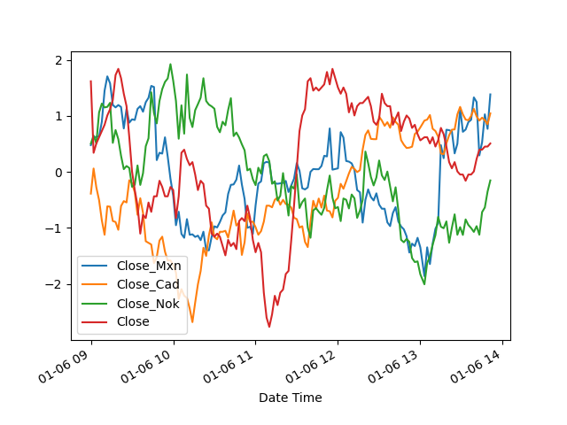
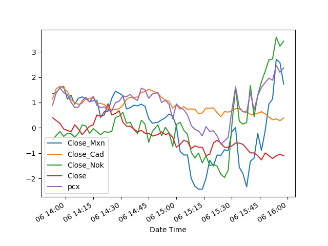

# petro-currency-index
In recent history, the U.S. dollar has been highly correlated to oil price movements. Though, over the last 20 years, the U.S. Dollar Currency Index (DXY) has become increasingly decorrelated with this commodity. Furthermore, the existing composition of the index has not been adjusted since October 2016. Even though there have been other commodity indices designed since then, the lack of adjustment to global macro changes daily presents a challenge waiting to be solved. As a result, this project is a young data scientists attempt to design an index that actively adjusts its weighting to account for global macro changes in currency prices to correlate with commodity prices more accurately in the short term. 

The first challenge as always is collecting some data. I knew I would need currencies that were influenced by the price of oil, so the natural choices were the RUB, NOK, CAD, MXN, CLP, and BRL. Of course, finding long term historical minute data for these currencies is challenging if you’re looking for a low-cost option. I was only able to find dense, reliable minute data for NOK, CAD, and MXN. These should do fine for an exploratory example. The oil data used is continuous, unadjusted oil futures data. Data used for the analysis is dated from 2017 through 2021. I understand I should now add the 2022 data, but give me a break, if you think it’s important enough, you add it.
	

The idea behind the updated correlations is a continuous, daily rebalancing. This meant segmenting the dataset into individual days, back shifting the currency values by x, and optimizing the Pearson Correlation to this shifted value. The t-1 optimized weightings would then be applied to the currency index in the following day and be used to identify joint currency positions that could be taken to trade the impending moves because of oil fluctuations. 

Below is the currency and oil composite chart for a given day

These are the resultant weightings of the optimized pcx

After exploring the quality of forward correlations with the pcx, it was noted that using the first part (70%) of the trading day to optimize the index for the following hours was more effective. At least in single day analyses. 

In attempting to prove the viability of the index in having some forward predictability for joint currency positioning as well as better gauging the reaction of petro-currencies to changes in oil prices, I will be looking to optimize forward correlations. 

In this preliminary case, we are going to optimize 12 periods ahead with every 3rd minute being a data point. Both to eliminate noise in the data and improve optimization of Pearson’s correlations.
After modelling 1000 days under these conditions, the average correlation is only ~0.02 which is basically as good as a shot in the dark. Though a shot in the dark doesn’t require the computational resources that I’ve just used. 

In exploring this problem further, it would be useful as a reactive tool when the maximized forward-correlation in the testing period is more than some threshold; 0.7 for arguments sake. Unfortunately, when plotting even all correlations, there is no discernible predictable reactive pattern. 
The index itself is also challenged by the more volatile nature of currencies as compared to oil and is not really a viable position development tool when oil prices are flat. Moving forward to try and build a better tool, it may be worth using shorter time periods to determine a short term, composite position for the next 10 - 15 minutes. 

